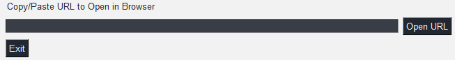

# GSLogger

> v1.6.5-Beta

---

## About GSLogger

- GSLogger is a simple Google search engine URL-scraper.
- Essentially users can search for a topic, (optionally) log the search results, and even open the URL from the application if desired, using the bottom-most input field.
  

---

## How to Use GSLogger?

- Simply enter a search query into the top-most text field.
  
- Next, choose whether or not to toggle saving a log of the search results.
  
- Click "Search", and wait for the search to finish.
  - Search results will appear in the output window below.
    
- Next, highlight a URL you wish to open, and use [CTRL + C] to copy the site link.
- Paste the link into the bottom-most text field using [CTRL + V].
- Finally, click the "Open" button to open the webpage in your default web-browser.
  

---

## Future Plans

- While this is an extremely simple project originally built for GUI-practice-purposes, I may expand on it now and again as I continue my CS education, so stay tuned for any improvements or updates in the future.
